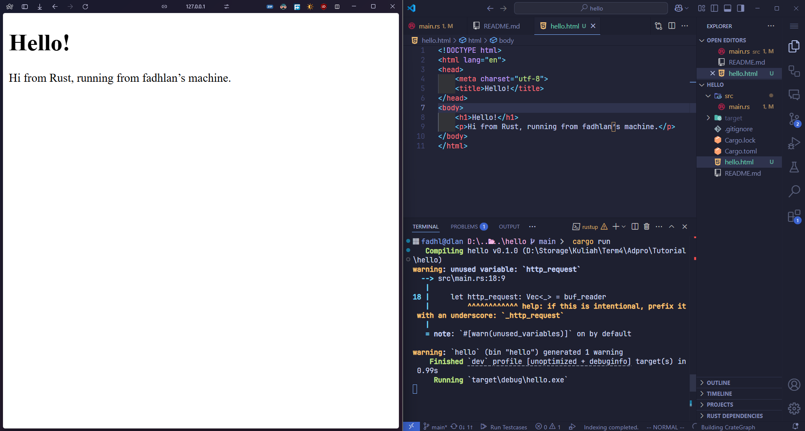
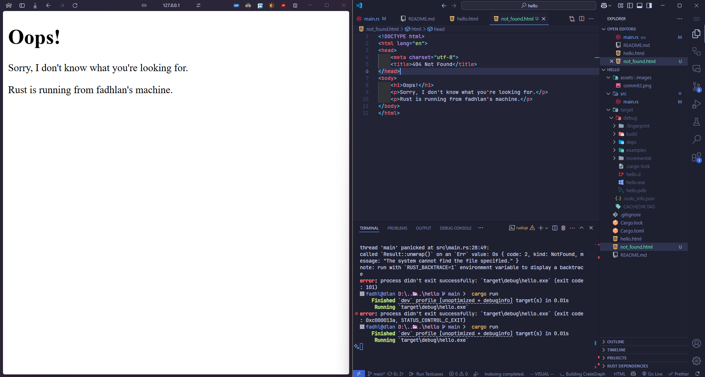

# rust-advpro | Advance Programming Repository by Muhammad Fadhlan Karimuddin (2306245011)

## Commit 1 Reflection notes

In this commit, I implemented a simple **single threaded** TCP server that listens on `127.0.0.1:7878`. This project has been a valuable opportunity to learn how Rust’s standard library can be used for network programming. I explored the use of `TcpListener` and `TcpStream` to accept and manage incoming connections sequentially. Delving into the `handle_connection` function, I learned how a `BufReader` can efficiently process incoming data line by line until an empty line indicates the end of an HTTP request header. Reading the Rust documentation for these components helped deepen my understanding of error handling, borrowing, and ownership in I/O operations.

### Deeper Dive into the `handle_connection` Function

The `handle_connection` function plays a critical role in managing each client connection. It begins by creating a `BufReader` from the mutable TCP stream:

```rust
let buf_reader = BufReader::new(&mut stream);
```

This use of `BufReader` not only simplifies reading from the stream but also improves performance by buffering input. Next, it processes the incoming data:

```rust
let http_request: Vec<_> = buf_reader
    .lines()
    .map(|result| result.unwrap())
    .take_while(|line| !line.is_empty())
    .collect();
```

In this snippet, the `lines` method creates an iterator over the stream’s content, and each line is unwrapped to obtain the string data. The `take_while` method ensures that reading stops when an empty line is encountered, which traditionally marks the end of the HTTP request header. Finally, the collected lines are printed out, providing a clear view of the request structure.

## Commit 2 Reflection notes

In this commit we updated the handle_connection method to correctly format the HTTP response headers so that the browser can render a proper HTML page. I changed the HTML content to display a custom message and ensured that the Content-Length header accurately reflects the size of the response body. This adjustment clarified for me how critical it is to adhere to HTTP protocol requirements so that browsers can properly process and display content. I learned that the Content-Length header is essential as it informs the client of the exact size of the data to be received, which is crucial for correct rendering. Additionally, I discovered that using BufReader improves the efficiency of stream reading, reducing the need for repeated system calls. Overall, this exercise not only enhanced my understanding of TCP stream handling but also deepened my appreciation for the intricacies of crafting valid HTTP responses.



## Commit 3 Reflection notes

Validating the Request and Selectively Responding

In this commit, I followed the instructions in Chapter 20 to validate incoming requests and selectively generate responses. I updated the handle_connection function to check whether the request line is "GET / HTTP/1.1" for a valid page or something else (like "GET /bad HTTP/1.1") for an error page. Splitting the response into two distinct parts was necessary because the HTTP status line and response body need to differ for successful and unsuccessful requests. Refactoring the code in this way improved readability and maintainability, ensuring that each response type is handled in its own block. This separation of concerns allows me to easily add or modify specific responses without affecting the rest of the logic. I also captured a screenshot of my browser rendering the custom error message when navigating to a bad URL.



## Commit 4 Reflection notes

In this commit, we intentionally simulated a slow response scenario by making the server pause for 10 seconds when the `/sleep` endpoint is requested. Observing this behavior with multiple browser windows provided a clear demonstration of how a single-threaded server processes requests one after the other, causing one request to block the others. This delay in response highlighted the performance limitations inherent in the current design and stressed the importance of using concurrency or asynchronous patterns for production-grade servers. I experimented with different endpoints to compare normal and delayed responses, which further reinforced my understanding of blocking operations in network programming. The insights gained from this exercise have encouraged me to explore multi-threading strategies in Rust for improved scalability. Overall, this commit underscored that even minor delays in a sequentially executing system can significantly degrade user experience.
